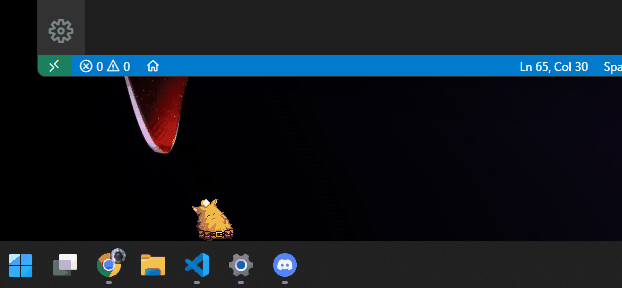
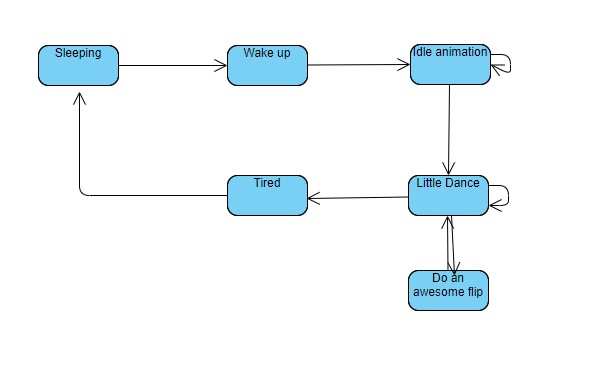

# desktop-pet



Desktop pet using Python. Sprites in the assets folder are stolen from Nitrome. This project is based off of [this Medium post](https://medium.com/analytics-vidhya/create-your-own-desktop-pet-with-python-5b369be18868) but the code in that post is highly inflexible and a lot of things are hard coded. My project allows the easy modification of the Pet using a JSON file.

## How to use

In main.py, there is a variable `CONFIG_URL`. This is a file path to a folder containing `config.json`, and all file paths in `config.json` are relative to `CONFIG_URL`. `config.json` defines the pet and has all the file paths to the gifs used to display it.

## How to get sprites from Nitrome (or any Flash game)

Get an SWF file from here:
https://archive.org/details/all_nitrome_games

Then decompile it using this tool
https://github.com/jindrapetrik/jpexs-decompiler
and extract all the image files. You can create gifs using ezgif or something.

## How to create your own pets

Basically, pets are finite state machines. The states and transitions are defined in the JSON file.



```json
{
    "state_name": "miner_tired",
    "frames": 7,
    "dims": [0, 0, 45, 50],
    "move": [2, 0],
    "file_name": "miner_idle.gif",
    "transitions_to": [
        {
            "name": "miner_tired",
            "probability": 0.8
        },
        {
            "name": "miner_sleeping",
            "probability": 0.2
        }
    ]
},
```

This is an example of a state definition.
"frames" is the number of frames in the gif.
"dims" is x offset, y offset, and the width and height of the gif. (if x offset is X, it will shift the image X relative to the pet's real position).
"move" means that each frame, the pet will move x, y pixels (this is useful for walking states).

I recommend you make your own gifs because my gifs are a little janky. Your gifs should all be the same resolution or else you will get weird visual artifacts.
